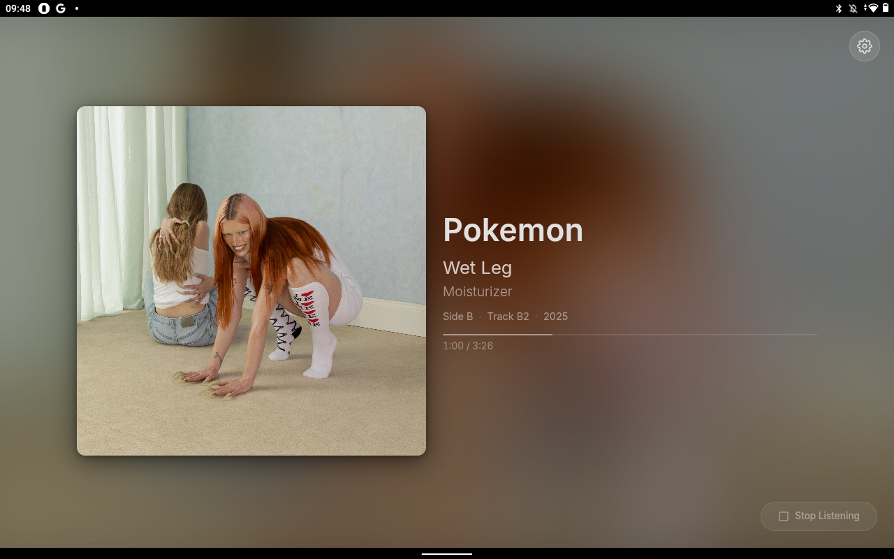
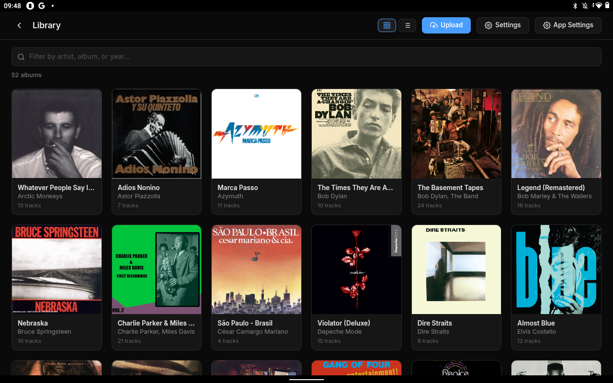

# WaxID

A local "Shazam" for record collection. Place a tablet next to your turntable and it automatically identifies what's playing, displaying the album art, track name, and metadata on a nice full-screen interface.

WaxID fingerprints your personal vinyl collection and matches live audio from the turntable microphone against it. No cloud services, everything runs locally on your network.

<p>
  
  
</p>

## How It Works

1. **Ingest** your record collection — upload audio files through the web UI or use the CLI script for batch ingestion
2. **Listen** — the Android tablet captures audio from the turntable and sends it to the server
3. **Match** — the server identifies the record in real-time
4. **Display** — the tablet shows the currently playing track with cover art, progress, and vinyl side/position info

## Server

Run the server with Docker:

```yaml
# docker-compose.yml
services:
  waxid:
    image: ghcr.io/leolobato/waxid:latest
    ports:
      - "8457:8457"
    volumes:
      - ./data:/app/data
    restart: unless-stopped
```

```bash
docker-compose up -d
```

Open `http://localhost:8457` to access the web UI. The `data/` directory stores the fingerprint database, album covers, and settings.

### Configuration

| Environment Variable | Default | Description |
|---|---|---|
| `WAXID_DB_PATH` | `./data/fingerprints.db` | Path to the SQLite database |
| `WAXID_MAX_QUERY_HASHES` | `0` (unlimited) | Cap the number of query hashes per match. Set to `500` for faster matching on low-power hardware at the cost of some accuracy. `0` uses all hashes. |

Example with Docker Compose:

```yaml
services:
  waxid:
    image: ghcr.io/leolobato/waxid:latest
    environment:
      - WAXID_MAX_QUERY_HASHES=500
```

### Web UI

The web UI lets you see what's currently playing in real-time with album art and track info, browse and manage your music library, and upload new albums for ingestion. Server settings (like Roon integration) are also configured here.

### Roon Now Playing

For a more configurable now-playing display, the server can push updates to [Roon Now Playing](https://github.com/arthursoares/roon-now-playing), which offers multiple layouts, fonts, backgrounds, and AI-generated track facts. Enable it from the Settings page in the web UI.

## Ingestion

You can add albums to your collection in two ways:

**Web UI** — drag and drop audio files or ZIP archives into the Upload page. Album metadata (artist, title, year, track names) is read from audio file tags automatically.

**CLI script** — for batch ingestion from a local music library:

```bash
python scripts/ingest.py /path/to/library --recursive --server http://your-server:8457
```

**Discogs integration** — include a `.txt` or `.md` file in your ZIP archive containing a Discogs release URL (e.g. `https://www.discogs.com/release/12345`). WaxID will fetch the tracklist from Discogs and automatically populate the vinyl side and position metadata (Side A, Track A1, etc.) for each track.

## Android Client

Install the APK from the [releases page](https://github.com/leolobato/waxid/releases) on an Android tablet (Android 10+).

On first launch, enter the WaxID server URL (e.g. `http://10.0.1.9:8457`). The app connects and displays the web UI. Tap the microphone button to start listening — the tablet captures audio and sends it to the server for matching.

### Remote Control

The app runs a local HTTP server on port **8458** so you can start and stop listening remotely:

- `POST /start` — start listening
- `POST /stop` — stop listening
- `GET /status` — current state

## Home Assistant

A [custom integration](https://github.com/leolobato/waxid-hass) exposes WaxID as a media player entity in Home Assistant. It connects to the server and the Android client to provide:

- **Media player** — shows the current track with artist, album, and cover art
- **Status sensor** — `idle`, `listening`, or `playing` for use in automations
- **Listening switch** — start and stop audio capture on the tablet remotely

Install via HACS or manually. You could, for example, use a smart plug to detect when your turntable is on and start/stop listening automatically.

## License

MIT License. See [LICENSE](LICENSE).
