# v1 — faster new-album lock (approved plan)

Changes vs. the reference flow, addressing the "takes 2–3 tracks to lock onto a
new record" problem. Changed steps are marked 🆕 in the chart and use blue nodes.
Approved 2026-06-11; see v2 for a simplified alternative.

```mermaid
flowchart TD
    A["Audio chunk arrives<br/>(every ~3s from client)"] --> B{"RMS ≥ -40 dBFS?<br/>(silence gate)"}
    B -- "no" --> S1["no_evidence_streak++ 🆕<br/>(unified streak replaces<br/>silence_streak)"] --> F0["feed([])"]
    B -- "yes" --> C["fingerprint_audio()"]
    C --> D{"≥ 150 hashes?<br/>(density gate)"}
    D -- "no" --> S1
    D -- "yes" --> E["Build hint set:<br/>current + expected-next<br/>+ challenger tracks 🆕<br/>(album of last frame's<br/>off-album raw leader)"]

    E --> M["match_hashes()<br/>offset voting, min_count = 6<br/>hinted tracks injected even<br/>below min_count (unchanged)"]
    M --> NS["note_signal() moved before<br/>boosts 🆕 — safe because<br/>side-flip is now latched"]
    NS --> EV["Evidence accounting 🆕<br/>locked-album candidate at raw ≥ 6 →<br/>no_evidence_streak = 0, else ++<br/>top RAW candidate off-album, raw ≥ 6 →<br/>off_album_streak++, else = 0"]

    EV --> BO{"Album locked?"}
    BO -- "no" --> B3["raw scores ×1.0"]
    BO -- "yes" --> B1["expected-next → ×2.5<br/>side-flip targets LATCH when<br/>no_evidence_streak ≥ 4, stay armed<br/>until promote or release 🆕<br/>on locked album → ×1.5"]
    B1 --> RS["Re-sort by boosted score"]
    B3 --> RS
    RS --> F["feed(candidates)"]
    F0 --> G
    F --> G{"Release checks 🆕<br/>off_album_streak ≥ 3 (≈9s)<br/>OR no_evidence_streak ≥ 15 (≈45s)?"}

    G -- "yes" --> REL["Release lock 🆕<br/>locked_album = None<br/>session_played = {}<br/>last_played = None<br/>challenger hints persist"]
    G -- "no" --> H
    REL --> H{"status = playing AND current<br/>boosted score ≥ 4 AND raw ≥ 6<br/>seen within last 6 frames? 🆕<br/>(maintain cap)"}

    H -- "yes" --> MAINT["Keep current track.<br/>miss_count = 0.<br/>(noise alone can no longer<br/>sustain it past ~18s)"]
    H -- "no" --> TOP{"Top candidate clears bar? 🆕<br/>locked album: boosted ≥ 10<br/>off-album / unlocked: raw ≥ 6<br/>with confidence ≥ 1.5×"}

    TOP -- "no" --> BUF0["Append None to buffer<br/>(size 3)"]
    TOP -- "yes" --> BUF1["Append top to buffer +<br/>pending candidates"]

    BUF1 --> SEQ{"Top is next track on<br/>same album as<br/>current/last_played?<br/>(sequential shortcut)"}
    SEQ -- "yes" --> PROM
    SEQ -- "no" --> STAB
    BUF0 --> STAB{"Any track appears<br/>2-of-3 in buffer?"}

    STAB -- "yes, and it's not current" --> PROM["PROMOTE:<br/>current = candidate<br/>status = playing<br/>anchor elapsed time<br/>clear buffer"]
    STAB -- "yes, it's current" --> KEEP["miss_count = 0"]
    STAB -- "no" --> MISS{"status = playing?"}
    MISS -- "yes" --> MC["miss_count++"]
    MC --> GR{"miss_count ≥ 6?<br/>(GRACE_MISSES)"}
    GR -- "yes" --> DROP["status = listening<br/>last_played = current<br/>current = None"]
    GR -- "no" --> ENDCHK
    MISS -- "no" --> ENDCHK

    PROM --> LOCK{"candidate.album ≠<br/>locked_album?"}
    LOCK -- "yes" --> NEWLOCK["Lock moves to new album<br/>session_played = {track}<br/>reset streaks + challenger<br/>hints + side-flip latch 🆕"]
    LOCK -- "no" --> ADDSESS["session_played += track"]
    NEWLOCK --> ENDCHK
    ADDSESS --> ENDCHK
    MAINT --> ENDCHK
    KEEP --> ENDCHK
    DROP --> ENDCHK

    ENDCHK{"playing AND elapsed ≥<br/>track duration?"} -- "yes" --> ENDED["Track ended:<br/>last_played = current<br/>current = None<br/>status = listening"]
    ENDCHK -- "no" --> DONE["Done — notify SSE<br/>subscribers on change"]
    ENDED --> DONE

    style PROM fill:#2d6a4f,color:#fff
    style MAINT fill:#9d4f1d,color:#fff
    style REL fill:#5b3a8c,color:#fff
    style S1 fill:#1d4f6a,color:#fff
    style E fill:#1d4f6a,color:#fff
    style NS fill:#1d4f6a,color:#fff
    style EV fill:#1d4f6a,color:#fff
    style B1 fill:#1d4f6a,color:#fff
    style G fill:#1d4f6a,color:#fff
    style H fill:#1d4f6a,color:#fff
    style TOP fill:#1d4f6a,color:#fff
    style NEWLOCK fill:#1d4f6a,color:#fff
```

## The five changes

### 1. Counter-evidence release (`off_album_streak`)

Each signal frame where the top **raw** (unboosted) candidate is off-album with
raw ≥ `min_count` increments a counter; an on-album raw leader resets it. At
**3 consecutive frames (≈9s)** the lock releases. This is the fast path for
record swaps: the new record only has to *out-match* the stale album three
frames in a row — it doesn't need to clear the promote bar to break the lock.

### 2. Challenger hints + lower cold-start bar

When an off-album track leads the raw ranking, its album-mates join the hint
set on the next frames, so the matcher surfaces them even below `min_count` —
the same machinery the locked album already enjoys. The promote bar for
off-album / unlocked candidates drops from boosted ≥ 10 to **raw ≥ 6 with
confidence ≥ 1.5× over the runner-up**, still requiring 2-of-3 stability.
Rationale: spec data shows genuine playing tracks routinely score 5–9; a bar of
10 with no boost made new-album detection structurally slower than everything
else. The confidence margin guards against the spurious-match problem the
gates were built for.

### 3. Maintain cap

The maintain early-return now also requires the current track to have shown a
**raw** score ≥ `min_count` at least once in the last 6 frames. Hint-injection
plus the ×1.5 boost alone (raw noise votes of ~3) can no longer keep a
wrongly-promoted track alive for its whole duration — the worst case drops
from "a full track" to ~18s.

### 4. No-evidence release (replaces silence-only release)

One unified `no_evidence_streak` counts every frame with **no evidence of the
locked album**: silent frames *and* signal frames where the locked album
produced no candidate at **raw ≥ `min_count` (6)**. Only an actual on-album
match resets it — hint-injected candidates below `min_count` don't count, since
the matcher surfaces hinted tracks on as little as 1 junk vote, which would
otherwise keep a stale lock alive forever (found in the 2026-06-11 adversarial
review). Talking or handling noise during a record change no longer restarts
the clock — the flaw that made the old 60s silence release nearly unreachable
in a real room.

**Why 15 readings (≈45s) and not 2–3:** the lock must survive the normal
no-match periods of an album playthrough —

| Situation | Typical no-match duration | Frames (~3s each) | At 2–3 readings | At 15 readings |
|---|---|---|---|---|
| Gap between songs | 2–4 s | 1–2 | borderline — random release inside an album | survives |
| Side flip | 15–45 s | 5–15 | **lock lost — side-flip boost never fires** | survives |
| Sparse track passage (Dona Olimpia) | 10–30 s below min_count | 3–10 | **lock lost mid-album** | survives (hints usually keep some on-album votes anyway) |
| Record swap | 30–90 s | 10–30 | releases (but #1 already handled it) | releases |
| Needle up / unknown record | indefinite | ∞ | releases | releases in ≈45 s |

The 2–3-reading version would release exactly when the lock is most useful
(side flips, sparse tracks). The fast-swap case it targets is already covered
by change #1, which is *positive* evidence (the new record matching) rather
than *absence* of evidence — a much safer trigger at small counts.

### 5. Ordering fix via side-flip latch

Side-flip targets are **latched** when `no_evidence_streak ≥ 4` while the
reference track is last-of-side, and stay armed until the next promote or a
lock release. Arming no longer depends on reading the live streak at boost
time, so `note_signal()` moves before `apply_boosts` without breaking the
side-flip boost — and the first music chunk of a *new* record is no longer
evaluated with the old album's ×2.5 side-flip targets active (they're still
latched, but change #1 clears them within ~9s, and the maintain cap limits any
damage from a bad first promote).

## New/changed constants

| Constant | Value | Meaning |
|---|---|---|
| `OFF_ALBUM_FRAMES_FOR_RELEASE` 🆕 | 3 | Consecutive off-album raw leaders before the lock releases |
| `NO_EVIDENCE_FRAMES_FOR_RELEASE` 🆕 | 15 | Frames without on-album evidence before the lock releases (was 20 silent frames) |
| `MIN_PROMOTE_SCORE_UNLOCKED` 🆕 | 6 | Raw promote bar for off-album / unlocked candidates (with conf ≥ 1.5) |
| `MAINTAIN_RAW_WINDOW` 🆕 | 6 | Current track must show raw ≥ min_count within this many frames |
| `SILENCE_FRAMES_FOR_FLIP` | 4 | Unchanged, but now latches instead of being read live |
| `MIN_PROMOTE_SCORE` / `MIN_MAINTAIN_SCORE` | 10 / 4 | Unchanged for the locked-album path |
