# v2 — simplified alternative

> **Implemented 2026-06-11** on branch `feat/album-lock-and-silence`.

Same goals as v1, but instead of adding counters to patch the lock system,
v2 removes the machinery those patches compensate for. One idea drives it:

> **The "album context" is simply the last confidently-identified track.**
> It powers matcher hints, a cheap sequential shortcut, and a sticky
> preference for the current track. It expires after ~45s without evidence.
> There is no separate lock state, no boosting, no session tracking.

The original bug was an *asymmetry*: locked albums promoted at effective raw
4–7 while new albums needed raw 10. v1 fixes it by helping the challenger
catch up (more streaks, more hints, dual bars). v2 fixes it by removing the
asymmetry: one promote bar for everyone, set where real tracks actually score.

> Amended 2026-06-11 after an adversarial review — 🔧 marks the three
> tightened spots (see [Review amendments](#review-amendments)).

```mermaid
flowchart TD
    A["Audio chunk arrives<br/>(every ~3s from client)"] --> B{"RMS ≥ -40 dBFS?<br/>(silence gate)"}
    B -- "no" --> S1["no_evidence_streak++"] --> F0["feed([])"]
    B -- "yes" --> C["fingerprint_audio()"]
    C --> D{"≥ 150 hashes?<br/>(density gate)"}
    D -- "no" --> S1
    D -- "yes" --> E["Hints: current track +<br/>sequential next (etn+1 —<br/>crosses sides naturally)"]

    E --> M["match_hashes()<br/>raw scores only — no boosts,<br/>no re-ranking; returns every track<br/>≥ min_count, no top-5 truncation 🔧"]
    M --> EV["Context-album candidate at<br/>raw ≥ 6 in results? 🔧<br/>yes → streak = 0<br/>no → no_evidence_streak++"]
    EV --> F["feed(candidates)<br/>full list enters the frame buffer,<br/>not just the top candidate"]
    F0 --> G
    F --> G{"no_evidence_streak ≥ 15?<br/>(≈45s)"}

    G -- "yes" --> REL["Context expires:<br/>last_played = None"]
    G -- "no" --> SEQ
    REL --> SEQ{"TOP raw candidate is the hinted<br/>sequential-next, at raw ≥ 4? 🔧<br/>(shortcut: strong prior — evaluated<br/>after stability, only when the current<br/>track isn't alive in the frame)"}

    SEQ -- "yes" --> PROM
    SEQ -- "no" --> STAB{"Any track at raw ≥ 6<br/>in 2 of last 3 frames?<br/>(counted per track across the<br/>full candidate lists)"}

    STAB -- "yes" --> CH{"Challenger guard 🔧:<br/>must outscore current's recent best<br/>(incl. live frame score);<br/>cross-album or no context →<br/>additionally conf ≥ 1.5× vs the field<br/>and vs current"}
    CH -- "yes" --> PROM["PROMOTE:<br/>current = candidate<br/>status = playing<br/>anchor elapsed time<br/>context follows automatically"]
    CH -- "no" --> KEEP["Keep current track"]
    STAB -- "no" --> MAINT{"Current track in results<br/>at raw ≥ 4? (it's hinted)"}
    MAINT -- "yes" --> KEEP2["miss_count = 0"]
    MAINT -- "no" --> MC["miss_count++"]
    MC --> GR{"miss_count ≥ 6?"}
    GR -- "yes" --> DROP["status = listening<br/>last_played = current<br/>current = None"]
    GR -- "no" --> ENDCHK
    KEEP --> ENDCHK
    KEEP2 --> ENDCHK
    PROM --> ENDCHK
    DROP --> ENDCHK

    ENDCHK{"playing AND elapsed ≥<br/>track duration?"} -- "yes" --> ENDED["Track ended:<br/>last_played = current<br/>current = None<br/>status = listening"]
    ENDCHK -- "no" --> DONE["Done — notify SSE<br/>subscribers on change"]
    ENDED --> DONE

    style PROM fill:#2d6a4f,color:#fff
    style REL fill:#5b3a8c,color:#fff
    style CH fill:#1d4f6a,color:#fff
    style STAB fill:#1d4f6a,color:#fff
    style SEQ fill:#1d4f6a,color:#fff
```

## What v2 removes (vs. v1)

| Removed | Why it's safe to remove |
|---|---|
| Score boosting (×1.5 / ×2.5), `apply_boosts`, `BoostInfo` | Boosts existed to lift on-album tracks over the bar of 10. With one bar at 6 (and 4 for the hinted sequential-next), nobody needs lifting — and boosted junk can no longer outrank a genuine new-album match. |
| `_locked_album_id` | The context album is just `(current or last_played).album_id`. No separate state to set, move, or release. |
| `_session_played` | Only existed to exclude played tracks from side-flip targets. Side-flip special-casing is gone. |
| Side-flip targets, silence-arming, v1's latch, the `sides` map logic | `effective_track_number` is album-wide, so "sequential next" already crosses sides: B1 = etn(A-last)+1. In-order playthroughs — the overwhelmingly common case — keep their fast path. |
| `off_album_streak` (v1 change #1) | A record swap no longer needs a release step. With no boosts and no early-return, the new album just wins stability directly (~3 frames at raw ≥ 6) and the context follows the promote. |
| Maintain early-return + v1's raw-score window (v1 change #3) | Challengers are always evaluated now; maintain only feeds the miss counter. A wrongly-promoted track is dethroned the moment something stable beats it, instead of squatting behind an early return. |
| Dual promote bars (v1 change #2) | One bar: raw ≥ 6 + 2-of-3 stability, with raw ≥ 4 for the hinted sequential-next. |

Two pieces of v1 survive unchanged: the unified **no-evidence streak** (your
"no matches" idea, 15 readings ≈ 45s) as the only expiry path besides idle,
and the **challenger hints** idea — generalized into "the candidate-frame
buffer counts every track, not just the top one," which is what lets a new
album accumulate stability even while old-album noise occupies rank 1.

## Why the numbers are equivalent, not weaker

- **Sparse next track (the Dona Olimpia case):** v1 = hinted + ×2.5 boost
  against a bar of 10 → effective raw bar 4. v2 = hinted + shortcut at raw ≥ 4.
  Identical threshold, no multiplication involved.
- **Other on-album tracks:** v1 = ×1.5 against bar 10 → effective raw ~6.7.
  v2 = bar 6 for everyone. Marginally more permissive, same regime.
- **New album:** v1 needed release (9s) *then* promote at raw ≥ 6 + stability.
  v2 promotes at raw ≥ 6 + stability directly — strictly fewer steps, and the
  1.5× confidence guard applies to *every* cross-album or no-context promote
  (not only when something is playing 🔧), matching v1's guard against
  spurious takeovers.

## Review amendments

Three holes found by the 2026-06-11 adversarial review, folded into the chart
above (🔧):

1. **Evidence needs a threshold, not presence.** Hinted tracks are injected
   into matcher results at *any* nonzero vote count, so "context-album
   candidate present" could be satisfied forever by 1–3 junk votes on the
   stale hinted track — recreating the unreachable-release flaw v2 set out to
   kill. Fix: `no_evidence_streak` resets only on a context-album candidate
   at **raw ≥ min_count (6)**. Same fix applies to v1's evidence accounting.
2. **The shortcut requires rank, not presence.** "Hinted next track present at
   raw ≥ 4" would let 4 junk votes instant-promote a stale track. Fix: the
   shortcut fires only when the sequential-next track is the **top raw
   candidate**, mirroring the current code's shortcut semantics.
3. **Full-list stability needs the full list.** The matcher truncates to
   `max_results=5`; a challenger ranked 6th could never accumulate stability.
   Fix: return **every track ≥ min_count** (the set is naturally small — it
   already exists in `track_best` before the slice), so the frame buffer's
   per-track counting sees everything credible. And the challenger guard
   (conf ≥ 1.5× vs runner-up) now applies whenever the promote is cross-album
   *or* there is no context — including the current = None windows (after
   track end, after a drop) that the previous wording left unguarded.
4. **The expiry clock measures the gap, not the track.** The streak also
   grows while a track is weakly maintained (raw 4–5 sits below the
   evidence bar), so `_drop_current` and `_end_track` reset it — otherwise
   a sparse or fading track would consume the 45s window before the gap
   even started, expiring the context ~3s after the needle lift
   (found during implementation review). The same reset applies on
   promote, idle, and the deletion hooks. Expiry is also suppressed while a track is playing — only gaps count.

## Honest trade-offs

1. **Out-of-order side play / needle-dropping around an album** loses its
   special boost. It falls back to the normal path: ~2 frames at raw ≥ 6
   (~6–9s) instead of a potential first-frame promote. In-order play —
   including normal side flips — keeps the fast path via etn+1.
2. **A persistent false positive could dethrone a genuinely-playing sparse
   track** if it clears 6 in 2-of-3 frames *and* beats the current track's
   recent raw score by 1.5×. The maintain-early-return previously blocked
   this (and was also why wrong tracks squatted). The margin check makes this
   unlikely, but it is a real behavior change: stickiness is now a score
   preference, not an absolute shield.
3. **Logs/UI top-candidate during weak frames** may show off-album junk at
   rank 1 more often (no re-ranking). Cosmetic — the state machine no longer
   cares about rank 1 exclusively.

## Constants after v2

| Constant | Value | Notes |
|---|---|---|
| `MIN_PROMOTE_SCORE` | 6 | Single bar, = `min_count`; was 10 |
| `MIN_SEQUENTIAL_SCORE` | 4 | Hinted sequential-next shortcut (must be top raw candidate 🔧); replaces ×2.5 |
| `MIN_MAINTAIN_SCORE` | 4 | Unchanged |
| `CROSS_ALBUM_MARGIN` | 1.5 | Confidence guard for every cross-album or no-context promote 🔧 |
| `MIN_EVIDENCE_SCORE` 🔧 | 6 | Context-album raw score needed to reset `no_evidence_streak` (= `min_count`) |
| `NO_EVIDENCE_FRAMES_FOR_RELEASE` | 15 | Context expiry (~45s); replaces all silence/lock-release constants |
| `BUFFER_SIZE` / `REQUIRED_MATCHES` | 3 / 2 | Unchanged, but buffer holds full candidate lists |
| Removed | — | `BOOST_ON_ALBUM`, `BOOST_EXPECTED_NEXT`, `SILENCE_FRAMES_FOR_FLIP`, `SILENCE_FRAMES_FOR_RELEASE`, `OFF_ALBUM_FRAMES_FOR_RELEASE`, `MAINTAIN_RAW_WINDOW` |

## Implementation note

v2 is mostly *deletion* from the current branch: `apply_boosts`, the side-flip
methods, `_session_played`, and the lock bookkeeping all go away. The new code
is a per-track stability count over full candidate frames and the challenger
comparison — both small. The only matcher change is dropping the
`max_results` slice in favor of returning every track ≥ `min_count` 🔧.
Net diff is likely negative. (Confirmed: the implementation removed more code than it added.)

Adversarial tests to add (from the review): hinted stale track at raw 1–3 for
>15 frames must not block expiry; a true new-album track ranked below 5th for
2-of-3 frames must still promote; repeated off-album raw-6 false positives
during a no-current window must not promote without the confidence margin.
