# Track selection and promotion flow

How the WaxID server decides what's "now playing", per 3-second listen chunk.
Covers the silence gates (`main.py`), the matcher hints (`matcher.py`), the
boost layer and the state machine (`state.py`).

```mermaid
flowchart TD
    A["Audio chunk arrives<br/>(every ~3s from client)"] --> B{"RMS ≥ -40 dBFS?<br/>(silence gate)"}
    B -- "no" --> S1["note_silence()<br/>silence_streak++"] --> F0["feed([])"]
    B -- "yes" --> C["fingerprint_audio()"]
    C --> D{"≥ 150 hashes?<br/>(density gate)"}
    D -- "no" --> S1
    D -- "yes" --> E["Build hint set:<br/>current track +<br/>expected-next track(s)<br/>(sequential next; side-flip<br/>targets if silence_streak ≥ 4)"]

    E --> M["match_hashes()<br/>offset voting, min_count = 6<br/>hinted tracks injected even<br/>below min_count"]
    M --> BO{"Album locked?"}
    BO -- "no" --> B3["boost ×1.0 (raw scores)"]
    BO -- "yes" --> B1["expected-next → ×2.5<br/>on locked album → ×1.5<br/>off-album → ×1.0"]
    B1 --> RS["Re-sort by boosted score"]
    B3 --> RS
    RS --> NS["note_signal()<br/>silence_streak = 0"]
    NS --> F["feed(candidates)"]
    F0 --> G
    F --> G{"silence_streak ≥ 20?"}

    G -- "yes" --> REL["Release lock:<br/>locked_album = None<br/>session_played = {}<br/>last_played = None"]
    G -- "no" --> H
    REL --> H{"status = playing AND current<br/>in candidates with score ≥ 4?<br/>(maintain check)"}

    H -- "yes" --> MAINT["Keep current track.<br/>miss_count = 0.<br/>⚠ all other candidates ignored<br/>this frame (early return)"]
    H -- "no" --> TOP{"Top candidate<br/>score ≥ 10?<br/>(MIN_PROMOTE_SCORE)"}

    TOP -- "no" --> BUF0["Append None to buffer<br/>(size 3)"]
    TOP -- "yes" --> BUF1["Append top to buffer +<br/>pending candidates"]

    BUF1 --> SEQ{"Top is next track on<br/>same album as<br/>current/last_played?<br/>(sequential shortcut)"}
    SEQ -- "yes" --> PROM
    SEQ -- "no" --> STAB
    BUF0 --> STAB{"Any track appears<br/>2-of-3 in buffer?"}

    STAB -- "yes, and it's not current" --> PROM["PROMOTE:<br/>current = candidate<br/>status = playing<br/>anchor elapsed time<br/>clear buffer"]
    STAB -- "yes, it's current" --> KEEP["miss_count = 0"]
    STAB -- "no" --> MISS{"status = playing?"}
    MISS -- "yes" --> MC["miss_count++"]
    MC --> GR{"miss_count ≥ 6?<br/>(GRACE_MISSES)"}
    GR -- "yes" --> DROP["status = listening<br/>last_played = current<br/>current = None"]
    GR -- "no" --> ENDCHK
    MISS -- "no" --> ENDCHK

    PROM --> LOCK{"candidate.album ≠<br/>locked_album?"}
    LOCK -- "yes" --> NEWLOCK["Lock moves to new album<br/>session_played = {track}"]
    LOCK -- "no" --> ADDSESS["session_played += track"]
    NEWLOCK --> ENDCHK
    ADDSESS --> ENDCHK
    MAINT --> ENDCHK
    KEEP --> ENDCHK
    DROP --> ENDCHK

    ENDCHK{"playing AND elapsed ≥<br/>track duration?"} -- "yes" --> ENDED["Track ended:<br/>last_played = current<br/>current = None<br/>status = listening"]
    ENDCHK -- "no" --> DONE["Done — notify SSE<br/>subscribers on change"]
    ENDED --> DONE

    style PROM fill:#2d6a4f,color:#fff
    style MAINT fill:#9d4f1d,color:#fff
    style REL fill:#5b3a8c,color:#fff
```

## Notes

- The **maintain check** (orange) is the early-return at `state.py:115` — while it
  passes, nothing else in the frame is considered, which is what lets a
  wrongly-promoted stale track squat for its full duration.
- The **two promotion paths** are the sequential shortcut (instant, single frame,
  relies on lock boosts to clear the score-10 bar) and the stability buffer
  (2-of-3 frames). A brand-new album can only use the second one, unboosted and
  unhinted.
- The **lock release** (purple) is the only in-session path that clears the lock
  besides a successful cross-album promote — and it needs 20 consecutive silent
  frames, since one signal frame resets the streak back at `note_signal()`.

## Key constants (`server/app/state.py`)

| Constant | Value | Meaning |
|---|---|---|
| `MIN_PROMOTE_SCORE` | 10 | Top candidate must reach this (boosted) score to enter the buffer |
| `MIN_MAINTAIN_SCORE` | 4 | Current track stays alive at this (boosted) score |
| `BUFFER_SIZE` / `REQUIRED_MATCHES` | 3 / 2 | Stability: same track tops 2 of last 3 frames |
| `GRACE_MISSES` | 6 | Frames without the current track before dropping to listening |
| `BOOST_ON_ALBUM` | ×1.5 | Candidate on the locked album |
| `BOOST_EXPECTED_NEXT` | ×2.5 | Sequential next / side-flip target on the locked album |
| `SILENCE_FRAMES_FOR_FLIP` | 4 | Silent frames before side-flip targets arm |
| `SILENCE_FRAMES_FOR_RELEASE` | 20 | Consecutive silent frames before the lock releases |
| `SILENCE_RMS_DBFS` | -40.0 | RMS gate threshold |
| `HASH_MIN_COUNT` | 150 | Hash-density gate threshold |
